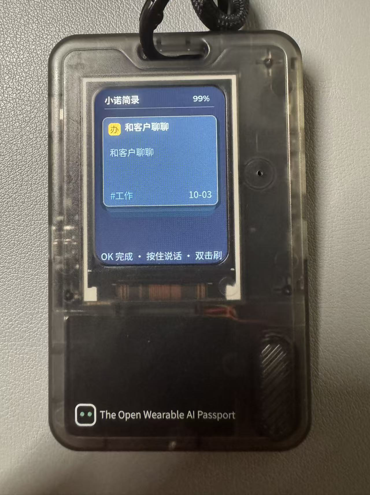
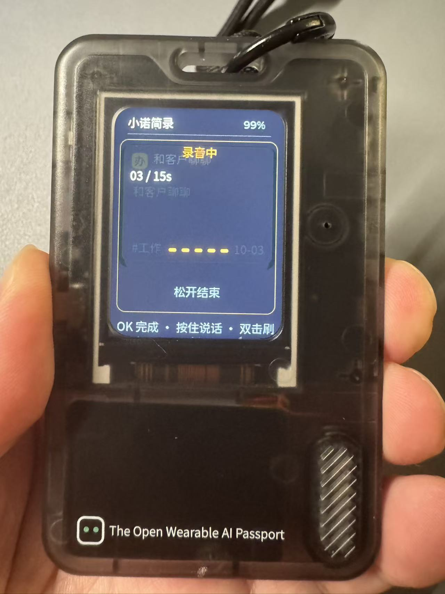
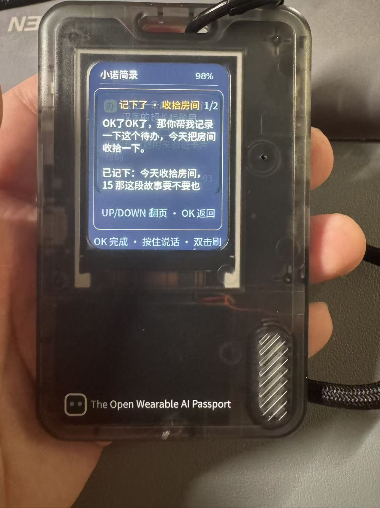
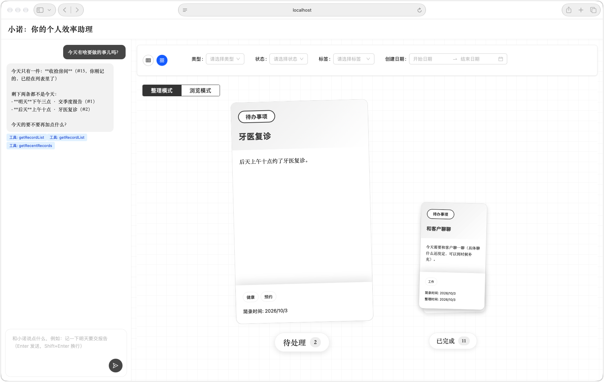
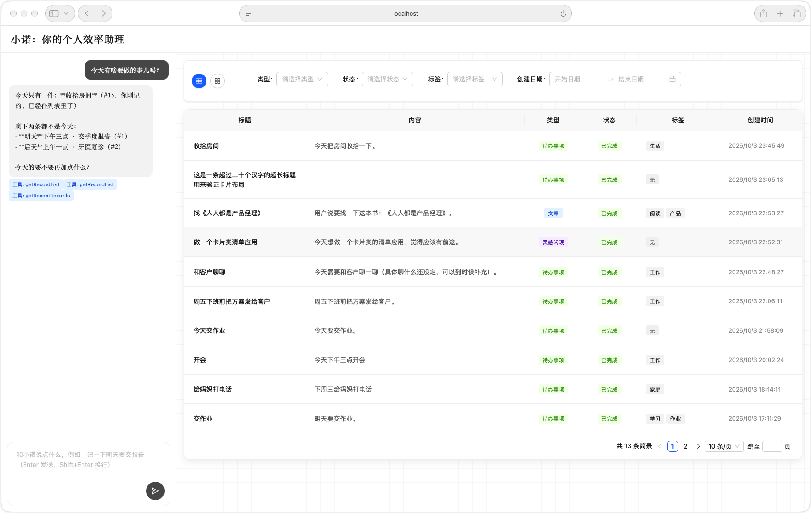
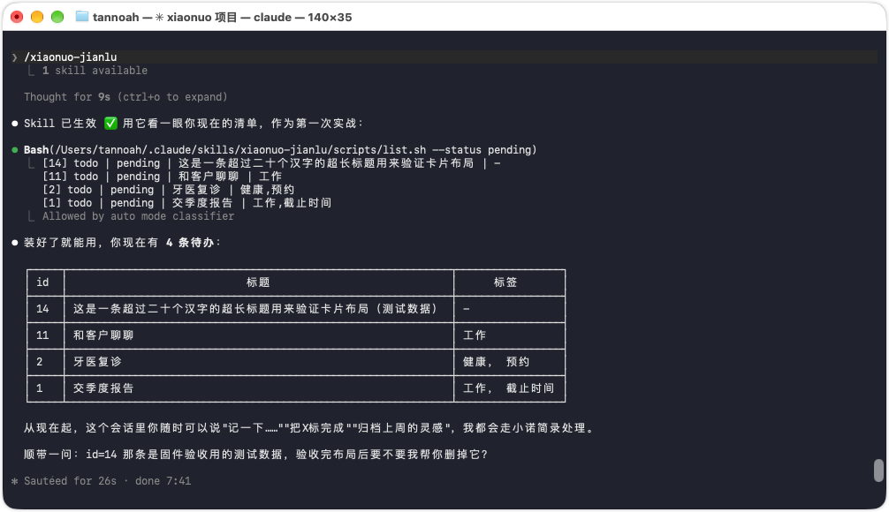

# 小诺简录（xiaonuo-jianlu）

> 把"对话即清单"搬到 AI 智能卡片上：**随时记录，随机整理**。

对着卡片说一句话，它就变成一张简录卡片；随口一句"把上周的灵感归档"，AI 帮你整理。
清单在**卡片、Web、Agent** 之间实时同步——记录不依赖手机电脑在场：
卡片独立联网工作，断网时录音存本地、内容可回放，联网后自动补传识别。

<!-- 实物：AI Passport 卡片上的小诺简录 -->


## ✨ 特性

**🎙 按住说话，随手就记**
按住卡片 OK 键说话（声波实时跳动 + 提示音），松手自动上传：ASR 识别 → LLM 判断意图 →
自动归类（待办/文章/灵感/其他）、起标题、打标签。一句话就是一条简录。

**🃏 堆叠卡片 UI**
清单以"一叠卡片"呈现：顶卡大卡片（类型徽标 + 标题 + 摘要 + 标签 + 日期），
后面的卡内收渐暗露出边缘；UP/DOWN 翻卡带飞出过渡，OK 完成一张划走一张。

**📴 离线也能用**
断网/中枢不可达时自动进入离线模式：清单可看可勾选（标注"待同步"）；
离线录音在清单里显示"未识别"占位卡，**可以本地回放原声**；
联网后自动补传识别、批量同步勾选。

**🔄 多端同步，一个数据源**
中枢（SQLite 单文件）是唯一数据源。卡片、Web 界面、Agent（Skill/MCP）都是入口：
卡片上勾完一条，Web 端 5 秒内消失；对 Agent 说"记一下……"，卡片刷新即见。

**🔋 随身带的续航**
60 秒无操作自动熄屏，10 分钟进入深睡，任意键唤醒（唤醒键不触发误操作）；
看门狗兜底，卡死自动重启自愈。

**🔌 零依赖部署**
中枢是 Express + SQLite 单进程，`npm start` 即跑；LLM/ASR 走 OpenAI 兼容格式，
豆包/DeepSeek/MiniMax/OpenAI 等改三行配置即可接入；卡片通过 mDNS 自动发现中枢。

## 📸 界面

**卡片（AI Passport 实物）**

| 堆叠卡片 | 按住说话（声波 + 计时） | 语音确认（分页查看） |
|---|---|---|
|  |  |  |

**Web 端与 Agent**

| Web 卡片视图 | Web 列表视图 | Agent Skill |
|---|---|---|
|  |  |  |

## 🏗 架构

```
┌─ AI Passport 卡片（ESP32-C3 固件）─────────────┐
│ 堆叠卡片 UI · 按住说话 · 离线队列 · 深睡省电     │
└──────────────┬──────────────────────────────────┘
               │ HTTP（局域网，mDNS 自动发现）
┌──────────────▼─── 中枢（hub/）───────────────────┐
│ Express + SQLite 单进程                          │
│ ASR/LLM：OpenAI 兼容格式云 API（可换 provider）   │
│ function calling 自动记录/整理（7 个工具）         │
│ 托管 Web 界面 · MCP 端点 · mDNS 广播              │
└──────────────┬───────────────────────────────────┘
               │
   Web 端（浏览器） · Agent 端（Skill / MCP）
```

## 📦 仓库结构

| 目录 | 说明 |
|---|---|
| `hub/` | 轻量中枢：API + ASR/LLM 适配 + SQLite 存储 + MCP 端点 |
| `hub/web/` | Web 界面（React + antd，移植自 [xiaonuo-assistant](https://github.com/noah-1106/xiaonuo-assistant) 的简录卡片页面） |
| `skills/xiaonuo-jianlu/` | Agent Skill：让任何 AI Agent 都能记录/查询/整理简录 |
| 固件 | 独立仓库：[noah-1106/ai-passport](https://github.com/noah-1106/ai-passport/tree/feature/xiaonuo-jianlu)（folotoy/ai-passport fork，`feature/xiaonuo-jianlu` 分支） |

## 🚀 快速开始

### 中枢

```bash
cd hub
npm install
cp .env.example .env   # 填入 LLM key 和 ASR key（任何 OpenAI 兼容服务）
cd web && npm install && npm run build && cd ..
npm start              # http://localhost:3000
```

没有 key 可先体验全链路（内置 mock）：`MOCK_LLM=1 MOCK_ASR=1 npm start`

```bash
curl -X POST http://localhost:3000/api/chat/send \
  -H 'Content-Type: application/json' \
  -d '{"message": "记一下明天要交季度报告"}'
```

### Agent 接入（二选一或都用）

**MCP**（常驻，推荐支持 MCP 的客户端）：

```bash
claude mcp add --transport http xiaonuo http://localhost:3000/mcp
```

**Skill**（任何能跑 shell 的 Agent）：

```bash
cp -R skills/xiaonuo-jianlu ~/.claude/skills/
```

### 卡片

见固件仓库 [feature/xiaonuo-jianlu](https://github.com/noah-1106/ai-passport/tree/feature/xiaonuo-jianlu) 分支。
刷入固件后：开机进配网模式 → EspBlufi App 下发 Wi-Fi → mDNS 自动发现中枢 → 开用。

## 🔌 API

| 接口 | 说明 |
|---|---|
| `POST /api/chat/send` | 对话入口，AI 自动记录/整理 |
| `POST /api/device/capture` | 语音记录：音频 → ASR → 建/整理简录（原始音频流或 multipart） |
| `GET /api/records` | 列表（type/status/tag/分页） · `GET /api/records/recent` · `GET /api/records/search?keyword=` |
| `POST /api/records` · `PUT /api/records/:id` · `DELETE /api/records/:id` | 手动 CRUD |
| `POST /mcp` | MCP 端点（7 个简录工具） |
| `GET /api/health` | 健康检查 |

## 📋 简录数据模型

| 字段 | 说明 |
|---|---|
| title / content / summary | 标题 / 内容 / 摘要 |
| type | `todo` 待办 / `article` 文章 / `inspiration` 灵感 / `other` 其他 |
| status | `pending` 待处理 / `completed` 已完成 / `archived` 已归档 |
| tags / link / startTime / endTime | 标签、链接、起止时间 |

## ⚙️ LLM / ASR 配置

均走 OpenAI 兼容格式，改 `.env` 即可换 provider：

- LLM：`LLM_BASE_URL / LLM_API_KEY / LLM_MODEL`（豆包/DeepSeek/MiniMax/OpenAI…）
- ASR：`ASR_BASE_URL / ASR_API_KEY / ASR_MODEL [/ ASR_PATH]`（OpenAI Whisper/Groq/硅基流动/MiniMax…）

## 🙏 致谢

- 硬件与固件基线：[FoloToy AI Passport](https://github.com/folotoy/ai-passport)
- 灵感与页面原型：[xiaonuo-assistant](https://github.com/noah-1106/xiaonuo-assistant)
- 中文字体：Noto Sans CJK SC（SIL OFL 1.1）
